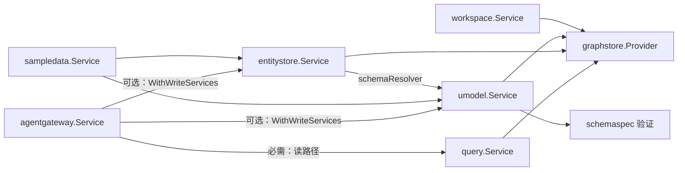
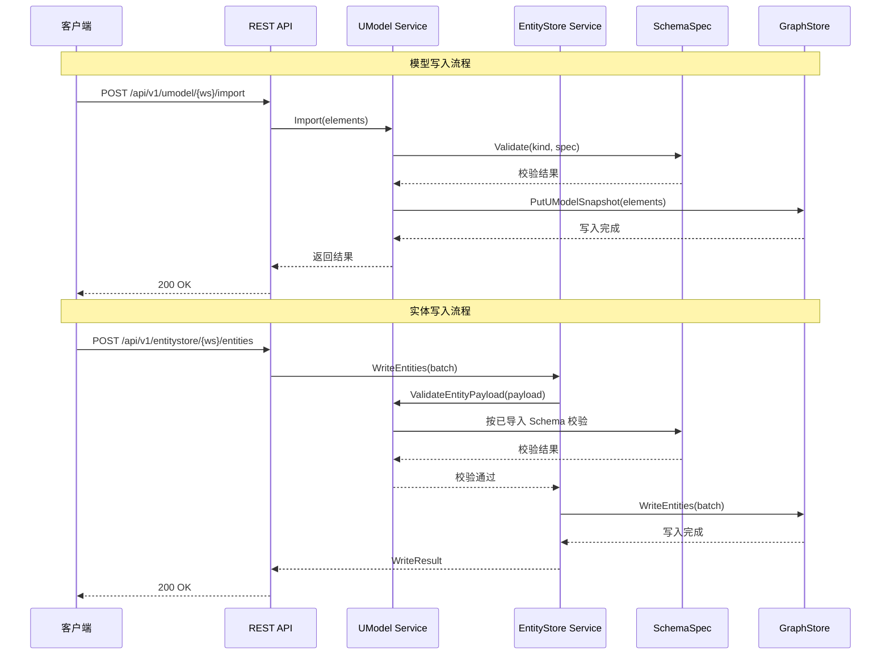
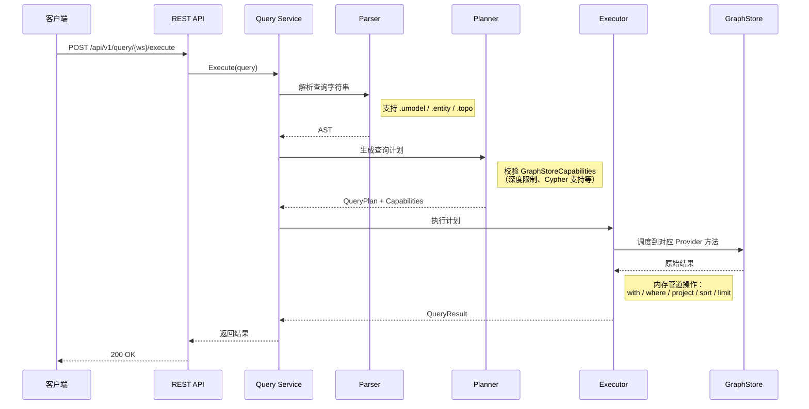
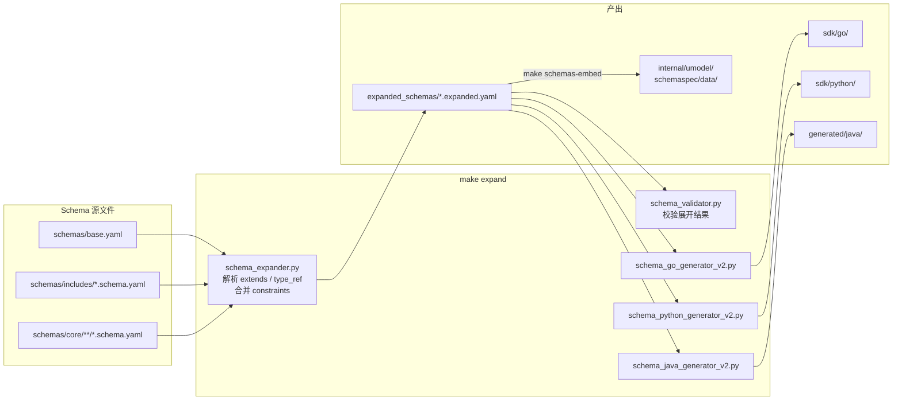
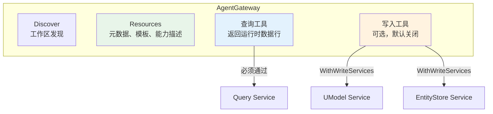

# CLAUDE.md

This file provides guidance to Claude Code (claude.ai/code) when working with code in this repository.

Read `AGENTS.md` first. It is the primary AI-agent guide for this repository.

## 项目概述

UModel 是一个开源的对象图语义层，面向可观测性与运维数据。

核心理念：

- Model Pack 定义对象词汇与关系语义
- EntityStore 写入运行时实体与拓扑关系
- Query Service 统一读取，查询源为 `.umodel`、`.entity`、`.topo`
- AgentGateway 和 MCP 暴露面向 Agent 的发现、资源、查询示例与工具
- Web UI、CLI、REST、SDK 共享公共契约

不要将 UModel 称为 MVP、骨架、原型、玩具或内部演示。

## 命令

### 运行

```bash
make quickstart          # API + Web UI + 示例数据，GRAPHSTORE=memory（内存态，退出即失）
make dev                 # API + Web UI，GRAPHSTORE=file.memory（持久化到 data/）
make stop-all            # 停止所有后台服务
make status              # 查看运行进程、端口和健康状态
```

端口 8080 被占用时，同时覆盖两个变量：
```bash
API_ADDR=:18080 API_URL=http://localhost:18080 make quickstart
```

### 构建

```bash
make build               # build-service + build-ui + build-sdk-go
make build-service       # go build ./cmd/...
make build-ui            # pnpm build in web/
```

### 测试

```bash
make test-service        # go test ./...
make test-ui             # 类型检查 + 构建 Web UI
make test-ui-e2e         # Playwright E2E 测试（需先启动 quickstart）
make test-capability     # go test -v -run TestCapabilityGate ./tests/integration/
make guard               # 架构守卫（见下文）
```

运行单个测试：
```bash
go test -v -run TestQueryParser ./internal/query/
go test -v -run TestHTTPQuickFlow ./tests/integration/
go test -v -run TestParse ./internal/query/
```

Ladybug provider 测试（编译门控）：
```bash
UMODEL_TEST_LADYBUG=1 go test -tags ladybug ./...
```

### Schema 与 SDK 管线

```bash
make expand              # 展开 schemas → 校验 → 生成 Go/Python/Java SDK → 嵌入
make schemas-embed       # 将 expanded_schemas/ 复制到 internal/umodel/schemaspec/data/
make schemas-embed-check # CI 门控：diff expanded_schemas/ 与嵌入数据
make verify              # 校验 Go + Python + Java SDK 编译/通过
make example-validate    # 校验示例 UModel YAML 文件
```

编辑 `schemas/` 下的任何内容后，必须运行 `make expand` 并提交更新后的 `expanded_schemas/` 和 `internal/umodel/schemaspec/data/`。

### 完整 CI 门控

```bash
make ci                  # guard + schemas-embed-check + build-service + test-service + test-capability + test-quickstart-health + verify + check-manifest + example-validate
```

## 架构

### 系统架构总览

```mermaid
graph TB
    subgraph 客户端
        WEB["Web UI<br/>React + Vite"]
        CLI["umctl CLI"]
        SDK["SDK<br/>Go / Python / Java"]
        MCP["MCP Client"]
    end

    subgraph REST API ["REST API (:8080)"]
        EP_WS["/api/v1/workspaces"]
        EP_UM ["/api/v1/umodel/{ws}"]
        EP_ES["/api/v1/entitystore/{ws}"]
        EP_QY["/api/v1/query/{ws}"]
        EP_AG["/api/v1/agent/{ws}"]
        EP_SP["/api/v1/samples/{ws}"]
    end

    subgraph 服务层
        WS["Workspace Service<br/>工作区元数据"]
        UM["UModel Service<br/>模型校验/导入/写入/删除/导出/索引"]
        ES["EntityStore Service<br/>运行时实体与关系写入/过期/删除"]
        QS["Query Service<br/>统一读取路径"]
        AG["AgentGateway Service<br/>Agent 发现/工具/资源"]
        SD["SampleData Service<br/>示例数据加载"]
    end

    subgraph 存储层
        GS["GraphStore<br/>Provider 注册表"]
        MEM["memory<br/>纯内存"]
        FM["file.memory<br/>内存 + JSON 持久化"]
        LB["local.ladybug<br/>编译门控"]
        SS["SchemaSpec<br/>嵌入的展开 Schema"]
    end

    WEB --> EP_WS & EP_UM & EP_ES & EP_QY & EP_AG
    CLI --> EP_WS & EP_UM & EP_ES & EP_QY
    SDK --> EP_WS & EP_UM & EP_ES & EP_QY
    MCP --> AG

    EP_WS --> WS
    EP_UM --> UM
    EP_ES --> ES
    EP_QY --> QS
    EP_AG --> AG
    EP_SP --> SD

    UM --> GS & SS
    ES --> GS & UM
    SD --> UM & ES
    QS --> GS
    AG --> QS & UM & ES

    GS --> MEM & FM & LB
```

### 服务依赖与组装顺序

`internal/bootstrap/app.go` 是组合根，按以下顺序组装服务：



关键设计：每个服务为依赖声明**本地接口**（接口隔离原则）。`pkg/contract.GraphStore` 是公共契约，由 Provider 实现，但消费方仅窄化至所需方法。

### 数据流：写入路径



### 数据流：读取路径



### Schema 构建时管线



运行时：Go 通过 `//go:embed` 将 `schemaspec/data/` 嵌入二进制。`umodel.Service.Validate()` 根据 `kind` 在 `Registry` 中查找 Schema，递归校验 `spec` 字段。

### GraphStore Provider 注册表

Provider 通过 `init()` 在 `internal/graphstore/provider.go` 中注册：

| 名称 | 行为 |
|---|---|
| `memory` | 纯内存，退出即失 |
| `file.memory` | 嵌入 `MemoryStore`，追加 JSON 持久化到 `data/graphstore/file-memory/` |
| `local.ladybug` | 编译门控：无 `-tags ladybug` 时为 stub（不可用），有 tag 时为真实实现 |

### AgentGateway 工具/资源边界



- Resources 仅暴露元数据，不返回运行时数据
- 查询工具必须通过 Query Service 返回数据行
- 写入工具通过 `WithWriteServices()` 可选注入，默认不启用

### Web UI

React + TypeScript + Vite，位于 `web/src/`。`api/client.ts` 中的 `UModelApi` 类仅调用公共 REST 端点。Vite 将 `/api` 和 `/healthz` 代理到后端（通过 `UMODEL_API_TARGET` 配置）。`vite.config.ts` 对重依赖（Monaco、XYFlow、Cosmos、Graphviz）配置了 chunk 分割。

## 架构守卫

`make guard` 运行 `tools/guards/architecture_guard.py`，执行以下规则：

1. **禁止工作区生命周期 API** — `/api/v1/workspaces/{ws}/start|stop|restart|backup|restore` 模式被禁止
2. **禁止 UModelAssistant** — `umodelassistant` 符号不属于开源运行时
3. **领域读取必须通过 Query Service** — 直接 REST 端点如 `/api/v1/entities` 或 `/api/v1/relations` 被禁止
4. **禁止 CLI 领域读取命令** — `umctl entity|get|list|search|topo neighbors|topo subgraph` 被禁止
5. **Provider 导入限制** — 仅 `internal/bootstrap/app.go` 和 ladybug stub/impl 文件可导入 `internal/graphstore/provider/(ladybug|cloud|custom)`

修改路由、公共 API、服务边界、查询行为、Provider 接线、AgentGateway、MCP 或 Web UI API 用法后，必须运行 `make guard`。

## 文档规则

- 根 README 面向用户，聚焦价值、快速上手、Web UI、Agent/MCP 集成、Query Service、文档和治理
- 不要在根 README 中添加内部模块清单表格
- 中英文文档为独立文件
- 配对更新 `docs/en/**` 和 `docs/zh/**`
- 保持 `README_CN.md` 与 `README.zh-CN.md` 一致
- 保持快速上手文档与 `Makefile` 中 `QUICKSTART_SAMPLE` 对齐

## 完成前检查

```bash
git diff --check
```

最终回复应包含：变更文件、已执行的验证、未执行验证及原因、未触碰的无关联脏文件。
