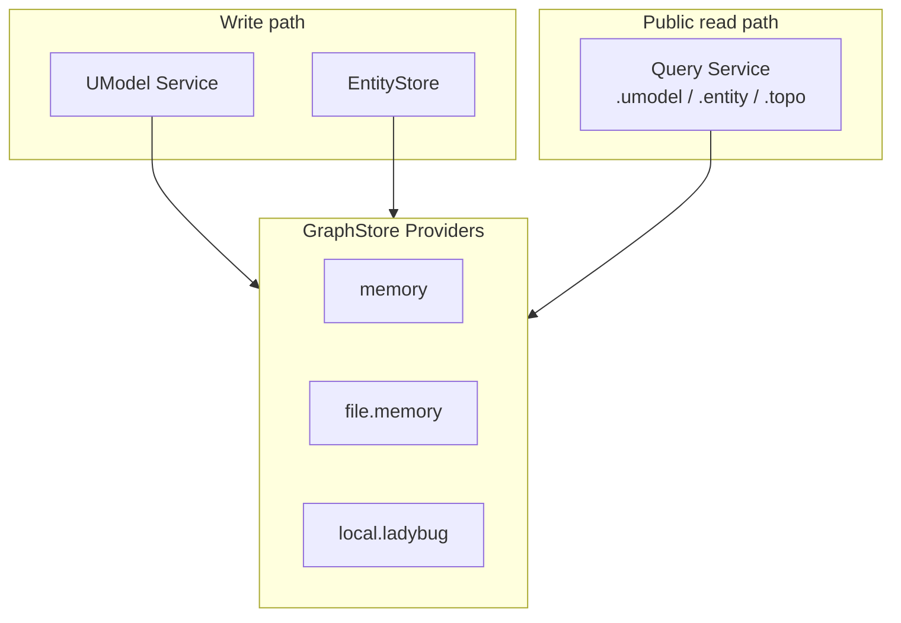
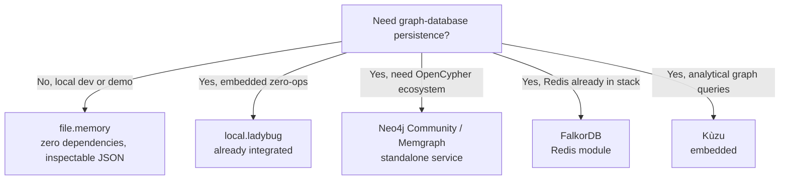

# Graph Database Support And Extension Guide

中文：[图数据库支持与扩展指南](../../zh/guides/graph-database-extension.md)

UModel stores UModel elements, runtime entities, and topology relations through the `GraphStore` interface. This guide summarizes the built-in providers, explains how to add new graph storage backends, and recommends open-source options for small to medium workloads.


## Built-In Providers

UModel persists graph-shaped data through **GraphStore providers**, not by binding directly to arbitrary third-party graph database products.

| Provider | Type | Persistence | Typical use | Cypher / graph queries |
|---|---|---|---|---|
| `memory` | In-memory maps | Process memory only; data is lost on restart | `make quickstart`, unit tests | Read-only Cypher through the pure Go engine (Ladybug dialect) |
| `file.memory` | In-memory maps + JSON snapshots | `<data>/graphstore/file-memory/` | `make dev`, Docker/Compose defaults | Same as `memory` |
| `local.ladybug` | Embedded Ladybug graph database | Ladybug database files under `--data` | Default provider in code when `--graphstore` is omitted | Writes use Ladybug Cypher; controlled Cypher queries still run through the shared Go engine |
| `remote.neo4j` | Remote Neo4j over Bolt | Neo4j server storage | Multi-client or multi-replica UModel deployments | Shared remote store with workspace-scoped labels and properties |
| `remote.memgraph` | Remote Memgraph over Bolt | Memgraph server storage | Same as `remote.neo4j` when Memgraph is already in the stack | Same GraphStore contract as `remote.neo4j` |

Important distinctions:

- `memory` and `file.memory` are **not** standalone graph databases. They are UModel's in-memory graph model with optional JSON persistence.
- `local.ladybug` is the only built-in provider backed by a **real embedded graph database** ([LadybugDB](https://github.com/LadybugDB/ladybug)).
- The repository does **not** ship built-in integrations for Neo4j, JanusGraph, NebulaGraph, ArangoDB, or similar products.

Select a provider at startup:

```bash
# Development default (Makefile: GRAPHSTORE=file.memory)
go run ./cmd/umodel-server --data data --graphstore file.memory

# Embedded Ladybug graph database (requires build tag and liblbug)
go run -tags ladybug ./cmd/umodel-server --data data --graphstore local.ladybug
```

Confirm the active provider from:

- `GET /healthz` → `graphstore.provider`
- Query explain output → `provider` and `storage_provider`



Provider semantics and file layout: [GraphStore Providers](../graphstore-providers.md).


## Can Graph Databases Be Extended?

Yes. GraphStore is an explicit extension point. See [Extension Points](../architecture/extension-points.md).

The core contract is `GraphStore` in [`pkg/contract/contracts.go`](../../../pkg/contract/contracts.go). A provider must implement:

- **Lifecycle**: `OpenWorkspace`, `EnsureSchema`
- **Model writes**: `PutUModelElements`, `GetUModelSnapshot`
- **Runtime writes**: `WriteEntities`, `WriteRelations`
- **Queries**: `QueryEntities`, `QueryTopo` (receiving `EntityQueryPlan` / `TopoQueryPlan`)
- **Observability**: `Capabilities`, `Health`

Capability flags affect Query explain pushdown and fallback behavior:

```go
type GraphStoreCapabilities struct {
    EntitySearch, GraphMatch, GraphCallNeighbors bool
    ControlledCypher, TimeVisibility, ServerSideFilter bool
    MaxDepth, MaxLimit int
    Timeout string
}
```

Conformance baseline: `exerciseGraphStore` in [`tests/contract/graphstore_contract_test.go`](../../../tests/contract/graphstore_contract_test.go).


## How To Add A Provider

Use `remote.neo4j` as an example name. Follow the existing Ladybug provider pattern.

### 1. Create a provider package

```text
internal/graphstore/provider/neo4j/
  provider_neo4j.go
  provider_neo4j_test.go
```

### 2. Register the provider

Add a constant in [`internal/graphstore/provider.go`](../../../internal/graphstore/provider.go) and register it from the provider package `init()`:

```go
const ProviderTypeNeo4j = "remote.neo4j"

func init() {
    graphstore.RegisterProvider(ProviderTypeNeo4j, func(config graphstore.ProviderConfig) (contract.GraphStore, error) {
        return NewProvider(config)
    })
}
```

### 3. Blank-import the provider in bootstrap

[`internal/bootstrap/app.go`](../../../internal/bootstrap/app.go) already blank-imports Ladybug:

```go
_ "github.com/alibaba/UnifiedModel/internal/graphstore/provider/ladybug"
```

Add the same pattern for each new provider so its `init()` runs.

### 4. Map the UModel data model

Mirror the Ladybug schema mapping in [`provider_ladybug.go`](../../../internal/graphstore/provider/ladybug/provider_ladybug.go):

- **Node labels**: `:umodel_node` (model elements), `:entity` (runtime entities)
- **Edge type**: `:topo` (topology relations)
- **Key fields**: `entity_key`, `relation_key`, `first_observed_time`, `last_observed_time`, `keep_alive_seconds`, `deleted`, `properties` (JSON-serialized property bag)
- **Workspace isolation**: separate database, graph space, or key prefix per workspace

### 5. Implement query semantics

Query Service parses `.entity` and `.topo` into `QueryPlan`. Providers must support:

| Capability | Notes |
|---|---|
| `with(...)` filters | `domain`, `name`, `ids`, text `query` |
| `time_range` | Historical visibility; expired/deleted rows hidden by default |
| `graph-call getDirectRelations` | Neighbor traversal |
| `graph-match` | Path pattern matching; requires `GraphMatch: true` |
| `graph-call cypher(...)` | Controlled read-only Cypher; requires `ControlledCypher: true` |

Current built-in strategy (Ladybug uses the same approach):

- Basic entity/topo queries: load candidate rows from storage, then filter in the provider with shared matching logic.
- Controlled Cypher: execute through the shared Go engine in [`internal/cypher`](../../../internal/cypher) on an in-memory graph snapshot (dialect: `ladybug`). Native backend Cypher execution is **not required** for a first integration.

A new provider can therefore store data in any backend and reuse the existing Go filter/Cypher engine for an initial release, then add server-side pushdown later for performance.

### 6. Expose the provider through CLI flags

`umodel-server` and `umodel-mcp` already accept `--graphstore`. After registration, the new provider name is selectable without CLI changes.

### 7. Test and guard

- Pass `exerciseGraphStore` conformance tests
- Add provider-specific integration tests (see [`provider_ladybug_test.go`](../../../internal/graphstore/provider/ladybug/provider_ladybug_test.go))
- Run `make guard` (business modules must not import provider implementation packages)
- Update [GraphStore Providers](../graphstore-providers.md) and this guide's Chinese counterpart

### 8. Architecture constraints

- Domain reads must stay behind Query Service (`.umodel`, `.entity`, `.topo`)
- Business modules (`internal/umodel`, `internal/entitystore`, `internal/query`) depend only on `contract.GraphStore`
- Web UI and SDKs use public REST only; they must not connect to graph databases directly


## Recommended Open-Source Graph Databases

These are technical recommendations, not an official product roadmap. Options are ranked by fit with UModel's current architecture.

### First tier

| Database | Open source | Scale | Why it fits | Integration effort |
|---|---|---|---|---|
| **Ladybug** | Yes (Apache 2.0) | Embedded, single-node SMB | Already integrated; matches UModel's Cypher dialect; no extra service | Low (`local.ladybug` exists) |
| **FalkorDB** | Yes | Redis module, single node or small cluster | OpenCypher compatible; low latency; good for neighbor queries | Medium (dialect adaptation or GraphStore in-memory engine) |
| **Kùzu** | Yes | Embedded analytical graph DB | Simple single-node deployment; strong local graph analytics | Medium (embedded like Ladybug; verify Cypher subset) |

### Second tier

| Database | Open source | Scale | Why it fits | Integration effort |
|---|---|---|---|---|
| **Neo4j Community** | Yes (community edition) | Single-node SMB | Mature OpenCypher ecosystem and tooling | Medium-high (separate service; schema mapping and dialect gaps) |
| **Memgraph** | Yes (community edition) | Single node or small cluster | High-performance OpenCypher; lighter than Neo4j | Medium (good Cypher compatibility) |

### Third tier

| Database | Notes |
|---|---|
| **ArangoDB** | Strong multi-model support, but AQL instead of Cypher; higher adapter cost |
| **NebulaGraph** | Distributed and operationally heavier; better for large scale than SMB single-node setups |
| **JanusGraph** | Depends on Cassandra/HBase-style backends; high SMB operations cost |

### Not GraphStore targets

- **Telemetry Storage definitions** (`sls_logstore`, `aliyun_prometheus`, and similar UModel elements) describe external telemetry organization, not runtime GraphStore backends. See [Storage And GraphStore Providers](../concepts/storage-and-graphstore.md).
- **Replacing Query Service with a graph database** breaks architecture invariants.


## Selection Guide



Practical advice for small to medium workloads (roughly up to low millions of nodes/edges per workspace):

1. **Default to `file.memory`** for open-source deployment with zero extra dependencies.
2. **Use `local.ladybug`** when you need real graph persistence and traversal (`GO_TAGS=ladybug GRAPHSTORE=local.ladybug make dev`).
3. **Add `remote.neo4j` or similar** when you need production OpenCypher tooling or already operate Neo4j; start with the GraphStore adapter and shared Go Cypher engine, then add pushdown.
4. **Evaluate FalkorDB** when Redis is already part of your stack.


## Related Files

- Provider registry: [`internal/graphstore/provider.go`](../../../internal/graphstore/provider.go)
- GraphStore contract: [`pkg/contract/contracts.go`](../../../pkg/contract/contracts.go)
- Ladybug reference implementation: [`internal/graphstore/provider/ladybug/provider_ladybug.go`](../../../internal/graphstore/provider/ladybug/provider_ladybug.go)
- Pure Go Cypher engine: [`internal/cypher`](../../../internal/cypher)
- Conformance tests: [`tests/contract/graphstore_contract_test.go`](../../../tests/contract/graphstore_contract_test.go)
