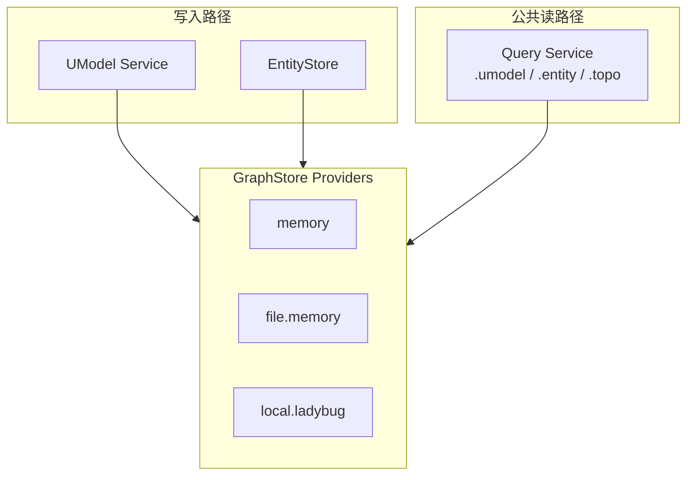
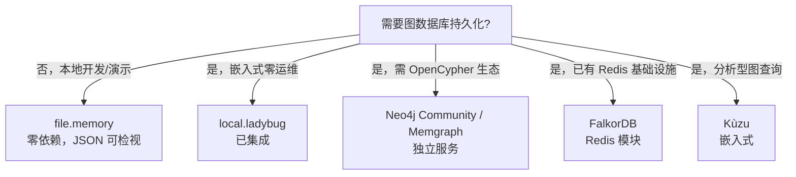

# 图数据库支持与扩展指南

English: [Graph Database Support And Extension Guide](../../en/guides/graph-database-extension.md)

UModel 通过 `GraphStore` 接口保存 UModel 模型元素、运行时实体和拓扑关系。本指南汇总内置 provider、说明如何接入新的图存储后端，并给出面向开源、中小规模工作负载的选型建议。


## 内置 Provider

UModel 的图数据通过 **GraphStore provider** 持久化与查询，而不是直接绑定任意第三方图数据库产品。

| Provider | 类型 | 持久化 | 典型场景 | Cypher / 图查询 |
|---|---|---|---|---|
| `memory` | 内存 Map | 进程内，重启丢失 | `make quickstart`、单测 | 纯 Go 只读 Cypher 引擎（Ladybug 方言） |
| `file.memory` | 内存 + JSON 快照 | `<data>/graphstore/file-memory/` | `make dev`、Docker/Compose 默认 | 同 `memory` |
| `local.ladybug` | 嵌入式图数据库 Ladybug | `--data` 下的 Ladybug 数据库文件 | 省略 `--graphstore` 时代码默认 provider | 写入走 Ladybug Cypher；受控 Cypher 查询仍经共享 Go 引擎 |
| `remote.neo4j` | Neo4j Bolt 远端图库 | Neo4j 服务端存储 | 多客户端或多副本 UModel 部署 | 共享远端存储，按 workspace 属性隔离 |
| `remote.memgraph` | Memgraph Bolt 远端图库 | Memgraph 服务端存储 | 与 `remote.neo4j` 相同，适合已有 Memgraph 基础设施 | 与 `remote.neo4j` 使用相同 GraphStore 契约 |

重要区分：

- `memory` 和 `file.memory` **不是**独立图数据库，而是 UModel 自研的内存图模型与可选 JSON 持久化。
- `local.ladybug` 是唯一对接**真实嵌入式图数据库**（[LadybugDB](https://github.com/LadybugDB/ladybug)）的内置 provider。
- 代码库**未内置** Neo4j、JanusGraph、NebulaGraph、ArangoDB 等产品集成。

启动时选择 provider：

```bash
# 开发默认（Makefile: GRAPHSTORE=file.memory）
go run ./cmd/umodel-server --data data --graphstore file.memory

# 嵌入式 Ladybug 图库（需构建标签与 liblbug）
go run -tags ladybug ./cmd/umodel-server --data data --graphstore local.ladybug
```

确认当前 provider：

- `GET /healthz` → `graphstore.provider`
- Query explain 输出 → `provider` 与 `storage_provider`



Provider 语义与文件布局见 [GraphStore Providers](../graphstore-providers.md)。


## 可否扩展图数据库？

可以。GraphStore 是明确的扩展点，见 [扩展点](../architecture/extension-points.md)。

核心契约为 [`pkg/contract/contracts.go`](../../../pkg/contract/contracts.go) 中的 `GraphStore` 接口，需实现：

- **生命周期**：`OpenWorkspace`、`EnsureSchema`
- **模型写入**：`PutUModelElements`、`GetUModelSnapshot`
- **运行时写入**：`WriteEntities`、`WriteRelations`
- **查询**：`QueryEntities`、`QueryTopo`（接收 `EntityQueryPlan` / `TopoQueryPlan`）
- **可观测**：`Capabilities`、`Health`

能力标志影响 Query explain 的 pushdown 与 fallback：

```go
type GraphStoreCapabilities struct {
    EntitySearch, GraphMatch, GraphCallNeighbors bool
    ControlledCypher, TimeVisibility, ServerSideFilter bool
    MaxDepth, MaxLimit int
    Timeout string
}
```

合规测试基准：[`tests/contract/graphstore_contract_test.go`](../../../tests/contract/graphstore_contract_test.go) 中的 `exerciseGraphStore`。


## 如何新增 Provider

以下以 `remote.neo4j` 为例，参照现有 Ladybug provider 模式。

### 1. 新建 provider 包

```text
internal/graphstore/provider/neo4j/
  provider_neo4j.go
  provider_neo4j_test.go
```

### 2. 注册 provider

在 [`internal/graphstore/provider.go`](../../../internal/graphstore/provider.go) 增加常量，并在 provider 包 `init()` 中注册：

```go
const ProviderTypeNeo4j = "remote.neo4j"

func init() {
    graphstore.RegisterProvider(ProviderTypeNeo4j, func(config graphstore.ProviderConfig) (contract.GraphStore, error) {
        return NewProvider(config)
    })
}
```

### 3. 在 bootstrap 中 blank import

[`internal/bootstrap/app.go`](../../../internal/bootstrap/app.go) 已对 Ladybug 使用 blank import：

```go
_ "github.com/alibaba/UnifiedModel/internal/graphstore/provider/ladybug"
```

每个新 provider 需同样处理，确保 `init()` 执行。

### 4. 映射 UModel 数据模型

参照 Ladybug 的 schema 映射（[`provider_ladybug.go`](../../../internal/graphstore/provider/ladybug/provider_ladybug.go)）：

- **节点标签**：`:umodel_node`（模型元素）、`:entity`（运行时实体）
- **边类型**：`:topo`（拓扑关系）
- **关键字段**：`entity_key`、`relation_key`、`first_observed_time`、`last_observed_time`、`keep_alive_seconds`、`deleted`、`properties`（JSON 序列化属性包）
- **Workspace 隔离**：每个 workspace 独立数据库、图空间或键前缀

### 5. 实现查询语义

Query Service 将 `.entity`、`.topo` 解析为 `QueryPlan`，provider 需支持：

| 能力 | 说明 |
|---|---|
| `with(...)` 过滤 | `domain`、`name`、`ids`、文本 `query` |
| `time_range` | 历史可见性；过期/删除记录默认隐藏 |
| `graph-call getDirectRelations` | 邻居遍历 |
| `graph-match` | 路径模式匹配；需 `GraphMatch: true` |
| `graph-call cypher(...)` | 受控只读 Cypher；需 `ControlledCypher: true` |

当前内置实现策略（Ladybug 亦如此）：

- 基础 entity/topo 查询：从存储层拉取候选集，在 provider 内用共享匹配逻辑过滤。
- 受控 Cypher：通过 [`internal/cypher`](../../../internal/cypher) 纯 Go 引擎在内存图快照上执行（方言：`ladybug`）。首版集成**不要求**底层图库原生执行 Cypher。

因此新 provider 可先将数据写入任意后端，复用现有 Go 过滤/Cypher 引擎完成首版，再在性能阶段逐步做服务端下推。

### 6. 通过 CLI 暴露

`umodel-server` 与 `umodel-mcp` 已支持 `--graphstore`。注册后即可选择新 provider 名称，无需改 CLI 结构。

### 7. 测试与门禁

- 通过 `exerciseGraphStore` 契约测试
- 补充 provider 集成测试（参考 [`provider_ladybug_test.go`](../../../internal/graphstore/provider/ladybug/provider_ladybug_test.go)）
- 运行 `make guard`（业务模块不得 import provider 实现包）
- 更新 [GraphStore Providers](../graphstore-providers.md) 及本指南英文版

### 8. 架构约束

- 领域读取必须经 Query Service（`.umodel`、`.entity`、`.topo`）
- 业务模块（`internal/umodel`、`internal/entitystore`、`internal/query`）只依赖 `contract.GraphStore`
- Web UI 与 SDK 只走公开 REST，不得直连图数据库


## 推荐的开源图数据库

以下为技术选型建议，非官方产品路线图。按与 UModel 现有架构的契合度排序。

### 第一梯队

| 图数据库 | 开源 | 规模定位 | 推荐理由 | 接入难度 |
|---|---|---|---|---|
| **Ladybug** | 是（Apache 2.0） | 嵌入式，单机 SMB | 已集成；与 UModel Cypher 方言一致；无额外服务 | 低（已有 `local.ladybug`） |
| **FalkorDB** | 是 | Redis 模块，单机/小集群 | OpenCypher 兼容；延迟低；适合邻居查询 | 中（方言适配或走 GraphStore 内存引擎） |
| **Kùzu** | 是 | 嵌入式分析图库 | 单机部署简单；本地图分析性能好 | 中（嵌入式类似 Ladybug；需验证 Cypher 子集） |

### 第二梯队

| 图数据库 | 开源 | 规模定位 | 推荐理由 | 接入难度 |
|---|---|---|---|---|
| **Neo4j Community** | 是（社区版） | 单机 SMB | OpenCypher 生态成熟、工具链完善 | 中高（独立服务；schema 映射与方言差异） |
| **Memgraph** | 是（社区版） | 单机/小集群 | 高性能 OpenCypher；比 Neo4j 轻量 | 中（Cypher 兼容性较好） |

### 第三梯队

| 图数据库 | 说明 |
|---|---|
| **ArangoDB** | 多模型能力强，但查询语言为 AQL 而非 Cypher，适配成本高 |
| **NebulaGraph** | 分布式、运维较重，更适合大规模而非 SMB 单机 |
| **JanusGraph** | 依赖 Cassandra/HBase 等后端，SMB 运维成本高 |

### 不宜作为 GraphStore 的场景

- **遥测 Storage 定义**（`sls_logstore`、`aliyun_prometheus` 等 UModel 元素）描述外部遥测组织方式，与运行时 GraphStore 是不同层次。见 [Storage 与 GraphStore](../concepts/storage-and-graphstore.md)。
- **用图数据库替代 Query Service** 违反架构不变量。


## 选型决策



中小规模（单 workspace 节点/边约在百万级以内）实用建议：

1. **默认使用 `file.memory`**：开源部署零依赖，适合开发、演示与贡献者工作流。
2. **需要真图库持久化与图遍历**：启用 `local.ladybug`（`GO_TAGS=ladybug GRAPHSTORE=local.ladybug make dev`）。
3. **需要生产级 OpenCypher 或已有 Neo4j 运维能力**：按本文步骤新增 `remote.neo4j` 等 provider；首版复用 GraphStore 适配器与共享 Go Cypher 引擎，再逐步做查询下推。
4. **团队已有 Redis**：评估 FalkorDB 作为轻量替代。


## 相关文件

- Provider 注册表：[`internal/graphstore/provider.go`](../../../internal/graphstore/provider.go)
- GraphStore 契约：[`pkg/contract/contracts.go`](../../../pkg/contract/contracts.go)
- Ladybug 参考实现：[`internal/graphstore/provider/ladybug/provider_ladybug.go`](../../../internal/graphstore/provider/ladybug/provider_ladybug.go)
- 纯 Go Cypher 引擎：[`internal/cypher`](../../../internal/cypher)
- 契约测试：[`tests/contract/graphstore_contract_test.go`](../../../tests/contract/graphstore_contract_test.go)
